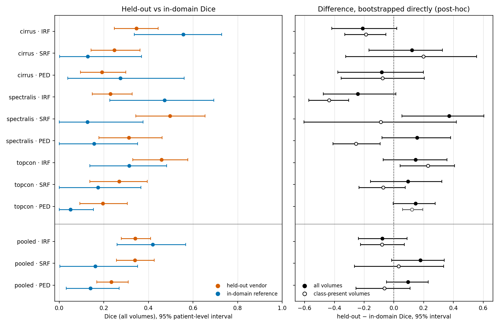

# OcuVal

A study of whether software that finds fluid in eye scans still works on a scanner brand it was never trained on, built and documented the way medical device software is.

## At a glance

- **What:** a pipeline that outlines three types of fluid in retinal OCT scans, converts the scans to standard medical imaging (DICOM) files, and includes tested code for packaging results as DICOM.
- **Question:** does it work as well on a scanner brand it never saw in training?
- **Answer:** no difference could be established. The study can only detect gaps larger than about 0.14 Dice, and [the report](docs/10_analytical_validation_report.md) shows exactly why.
- **How:** test data sealed until the end, the analysis written down before any results, training and evaluation reproducible, documented following medical device software standards (IEC 62304, ISO 14971).
- **Built with:** Python, PyTorch, MONAI, pydicom, highdicom, GitHub Actions.

> **Not for clinical use.** This is a research and portfolio project built on public challenge data. It has never been used on patients, has not been validated for patient care, and makes no clinical claim of any kind.



*Figure 1. Left: scores on the unseen brand (orange) and on new patients from the familiar brands (blue), with 95% intervals; the bottom three rows pool all three runs. Right: the difference between the two, with its own interval. Rows and panels marked post-hoc in [`docs/10`](docs/10_analytical_validation_report.md) were analysed after the results were seen.*

## In plain words

An OCT scan uses light to take cross-section pictures of the back of the eye, a bit like an ultrasound but far finer. In some common eye diseases, fluid collects in or under the retina, and doctors watch how much there is to decide on treatment and to see whether it is working. I trained a model that outlines three kinds of this fluid in OCT scans. Hospitals use scanners from different companies whose images look different, so I asked: if the model learns from two brands, does it still work on a third it has never seen? The honest answer is that I could not detect a difference, but this test could only have detected a large one, so it does not show that the model works on the new brand. The aim was a trustworthy measurement rather than the highest score, and part of why the scores are modest is the pattern described in [finding 2](#what-i-found): the model marks fluid in scans that have none of that type, though even counting only scans that do contain it, the scores stay moderate.

## What I found

**1. No difference could be established, and the test was only sensitive to large ones.** I trained the model three times, each time leaving one scanner brand out, and tested it on the brand it had not seen. I compared that score with its score on new patients from the brands it had seen. In all three cases, and for all three kinds of fluid, the two scores' 95% intervals overlapped, so no difference could be established. The gap went one way in some cases and the other way in others. Each comparison group from the familiar brands held only 7 patients, so the test could not reliably see a difference smaller than about 0.14 on the score used here (Dice, which runs from 0 to 1). When I bootstrapped the differences directly, as an extra check decided after seeing the results, one of the 9 excluded zero, and in that case the unseen brand scored *higher*. With that many comparisons and no correction for multiple testing, one such result is weak evidence, and this one is better explained by finding 2 than by the scanner brand. The full answer, with every interval, is in [`docs/10`](docs/10_analytical_validation_report.md).

**2. The model marks fluid in scans that have none of that type.** In most scans without a given fluid type, the model still marks a little of it. The score treats that as a complete miss for the scan, which drags the average down. For two of the three fluid types (SRF and PED), the groups from the familiar brands happened to contain more such scans, so part of those comparisons reflects which scans were in each group rather than the scanner brand. [`docs/10`](docs/10_analytical_validation_report.md) §5.2 and §7.1.

**3. With only 7 patients, the score is fragile.** If one scan without fluid flips between "nothing marked" and "a few pixels marked", its score jumps from 1 to 0, and a 7-patient average moves by about 0.14. I saw a shift of about that size (0.1431) between two equally valid runs of the same model, before I made the evaluation reproducible. The older run did not keep per-scan scores, so I cannot confirm that a single scan caused it. [`docs/10`](docs/10_analytical_validation_report.md) §7.2.

## Why you can trust it

The test scans were sealed: the code refuses to read them without a recorded reason and approval, and every access is logged. I wrote down the analysis before seeing any result, and anything decided afterwards is labelled post-hoc wherever it appears. Training and evaluation are reproducible: two runs of the evaluation had to match exactly, value for value, before any sealed scan was opened, and they did. Every requirement traces to a test, and the traceability counts are checked in CI. [`docs/07`](docs/07_vv_protocol.md) §17; [`docs/08`](docs/08_vv_report.md) §5g; [`docs/09`](docs/09_traceability_matrix.md).

## Worth a closer look

**A cross-check that caught a real defect before any result existed.** I first computed HD95 by pooling both directions of boundary distance into one list. Every test passed, because every test was written from the same understanding as the code. A check against an independent library (MONAI, TC-120) disagreed on 5 of 12 random cases while Dice agreed on all 12. I adopted the standard definition, the larger of the two directions, before reporting anything. [`docs/13`](docs/13_change_control_log.md), 2026-09-17.

**Refusing to make up scan details the data does not contain.** The dataset does not record which eye was scanned, but the DICOM standard requires that field and has no "unknown" value. The easy fix is to write a plausible value. The code refuses instead, or under an explicit research setting leaves the section out and logs it. A visible gap is safer than an invented fact every later reader would trust. [`docs/05`](docs/05_risk_management_file.md) RC-029 and HAZ-015; [`docs/11`](docs/11_dicom_conformance_statement.md).

**A pixel-spacing mix-up that only real data could reveal.** The source files store pixel spacing in a different axis order from this project. Every synthetic test used the project's own order, so none ever tested the conversion. For one brand, a swap would make a correct outline's fluid volume wrong by a factor of 6.0. A simple size check catches 0 of 210 swapped cases; checking against each brand's known spacing catches all 210. The lesson: a test written in the code's own convention cannot test a conversion. [`docs/13`](docs/13_change_control_log.md), 2026-09-23 and 2026-09-25; [`docs/07`](docs/07_vv_protocol.md) §3 rule 7 and §13.3.

**A data-use question settled by asking.** My own reading of the dataset agreement said publishing results here might not be allowed. Rather than pick the convenient reading, I asked a challenge organiser, who confirmed the same day that publishing results is permitted. My stricter reading stays in the record as the reason I asked. [`docs/06`](docs/06_data_management_plan.md) §2.2 and §2.2.1.

**Reproducibility found to be false, then made true and proven.** A resume check passed while a resumed training run was actually seeing data in a different order (D2). One GPU operation fell back to a non-repeatable method 1308 times, with a warning each time that was easy to miss (D3). I fixed both, and two training runs now produce byte-identical weights (TC-121). Two differently configured runs started nine hours apart agree to every recorded digit until their learning-rate schedules diverge (TC-123). Evaluation then turned out not to be repeatable either: two runs of one model differed in 49 figures. I seeded it, and required two runs to match exactly before opening any sealed scan. They matched on 466 of 466 values. [`docs/08`](docs/08_vv_report.md) D2, D3, §5g.1; [`docs/13`](docs/13_change_control_log.md), 2026-10-04.

**A sealed, pre-registered evaluation.** The analysis plan was committed before any held-out result existed. The test scans sit behind an unlock that needs a reason and an approver, and every access is logged. When one assumption written into the plan turned out to be false, I did not run the analysis that depended on it. I decided the replacement, committed it before computing anything, and labelled it post-hoc. [`docs/07`](docs/07_vv_protocol.md) §17, §17.10, §19, §19.5; [`docs/08`](docs/08_vv_report.md) §5g.

## Glossary

- **OCT (optical coherence tomography):** a scan that uses light to image the layers of the retina in cross-section.
- **IRF (intraretinal fluid):** fluid collected within the layers of the retina.
- **SRF (subretinal fluid):** fluid collected under the retina, between it and the layer beneath.
- **PED (pigment epithelial detachment):** a pocket where the retina's bottom layer lifts away from the tissue under it.
- **Scanner brand:** the company that made the OCT machine, called the vendor in the code and documents. This data has three: Cirrus (Zeiss), Spectralis (Heidelberg) and Topcon.
- **Fold:** one round of training and testing. Here each fold leaves one brand out for testing.
- **Dice:** overlap between the model's outline and the expert's, from 0 (none) to 1 (perfect).
- **HD95:** how far, in millimetres, one outline's boundary strays from the other's: the distance that 95% of boundary points stay within, taking the worse of the two directions.
- **Pre-registration:** writing down the analysis before seeing results, so the results cannot shape the method.
- **Sealed test set:** test data the code will not read without a recorded, approved unlock, so it is used once and only as planned.

## Quick start

Developed on Windows 11 with Python 3.11 and an NVIDIA GTX 1050; CI runs the tests on Ubuntu. Install from the lock, which is the environment the results were produced in. TC-099 fails if the installed environment drifts from it.

```bash
git clone https://github.com/Anurag-YadavIIH/retinal-oct-fluid-segmentation.git
cd retinal-oct-fluid-segmentation
python3.11 -m venv .venv
source .venv/bin/activate          # Windows: .venv\Scripts\activate
pip install -r requirements.lock
pip install -e ".[dev]" --no-deps
```

**The CUDA build of PyTorch cannot be expressed in the lock.** Training used `torch==2.3.1+cu121`, which is not on PyPI, so install it explicitly:

```bash
pip install --index-url https://download.pytorch.org/whl/cu121 \
    --force-reinstall --no-deps "torch==2.3.1"
python -c "import torch; print(torch.__version__, torch.cuda.is_available())"   # 2.3.1+cu121 True
```

**Machine-specific settings** are environment variables and are never committed: `OCUVAL_CACHE_DIR` (where the frame cache lives) and `OCUVAL_DEID_SALT` (see [`docs/06`](docs/06_data_management_plan.md) §5.1). **The dataset is not downloaded automatically.** RETOUCH requires registration; `scripts/00_fetch_data.py` documents the manual steps.

Tests, as CI runs them:

```bash
ruff check src tests scripts && ruff format --check src tests scripts
pytest -m "not requires_data and not requires_pacs"
```

Pipeline. **These commands need the RETOUCH training data, which is not included in this repository.** It must be requested from the challenge organisers, after registration, and used under their terms (see [Data, credits and licence](#data-credits-and-licence)).

```bash
python scripts/01_convert_to_dicom.py --config configs/data.yaml
OCUVAL_DEID_SALT=... python scripts/02_deidentify.py --config configs/data.yaml
python scripts/03_make_splits.py --config configs/folds
python scripts/04_train.py --fold configs/folds/cirrus_holdout.yaml --run-dir artifacts/runs/<run> --epochs 150
python scripts/05_evaluate.py --run artifacts/runs/<run> --bucket val
python scripts/07_make_figures.py
```

`test` and `in_domain_ref` are sealed: `05_evaluate.py` refuses them unless given `--unlock-bucket` with a reason and an approver, and records every access. Long runs are launched from an interactive terminal that is kept open ([`docs/07`](docs/07_vv_protocol.md) §17.8). DICOM objects produced here must stay on a local PACS, because the UID root is unregistered by declaration ([`docs/06`](docs/06_data_management_plan.md) §7.2).

## Repository map

| Path | Contents |
|---|---|
| [`docs/`](docs/) | The document set, from `01` intended use to `13` change-control log; `figures/` holds the result figures |
| `src/ocuval/io/` | RETOUCH and MetaImage reading, DICOM writing, de-identification, DICOMweb client |
| `src/ocuval/data/` | Patient-level splits, MONAI transforms, datamodule and frame cache |
| `src/ocuval/models/` | Segmentation network, MC-dropout uncertainty |
| `src/ocuval/training/` | Training loop, deterministic loss, checkpoints, accelerator telemetry |
| `src/ocuval/eval/` | Metrics (numpy and scipy, cross-checked against MONAI), patient-level bootstrap, sealed splits, evaluation pipeline |
| `src/ocuval/report/` | DICOM Segmentation and Structured Report objects |
| `src/ocuval/service/` | FastAPI inference service (stub) |
| `scripts/` | Numbered pipeline entry points `00` to `07`, the evaluation chain, the exact record comparison |
| `configs/` | Data, training and per-fold configuration |
| `tests/` | pytest suite; each test name carries its `TC-nnn` identifier |

## Status and limitations

**Works and is verified:** data conversion to DICOM and de-identification on all 70 scans; patient-level splits with a leakage test that gates CI; training and evaluation of all three folds; the sealed, reproducible evaluation and its report ([`docs/10`](docs/10_analytical_validation_report.md)); DICOM Segmentation and Structured Report objects, built and tested.

**Not done:**

- **The PACS round-trip.** The tests that store and retrieve the DICOM outputs through a local PACS (TC-080 to TC-082) are written but have never run, because Docker is not installed here.
- **Writing the model's results as DICOM files.** The builders exist and are tested, but no pipeline step calls them yet; `scripts/06_push_to_pacs.py` is a stub.
- **The inference service and `eval/report.py`** are stubs.
- **The model card, [`docs/12`](docs/12_model_card.md),** is still a template.
- **Optional analyses not run:** a RETOUCH leaderboard submission; the ablation that would measure how much of the brand difference the per-scan brightness normalisation removes ([`docs/10`](docs/10_analytical_validation_report.md) §8.1); and confidence intervals for AUROC, which the sealed records cannot provide ([`docs/08`](docs/08_vv_report.md) D9).

**Known weaknesses:** the familiar-brand comparison groups hold 7 patients per fold, so only large differences are detectable; the per-scan score is fragile when a fluid type is absent; and the reproducibility claims are proven on this machine's GPU and software versions only.

## How this was built

I designed this project and made its decisions: the research question and
cross-vendor design, the choice of dataset and how its data agreement was
handled, the safety classification, the evaluation protocol written before any
results existed, and the calls on what to report and how. I used Claude Code
(Anthropic) as a coding assistant.

## Data, credits and licence

This project uses the training data of the [RETOUCH challenge](https://retouch.grand-challenge.org/), the Retinal OCT Fluid Detection and Segmentation Benchmark and Challenge. I am grateful to the organisers for making the data available to researchers.

> Bogunović H, Venhuizen F, Klimscha S, et al. RETOUCH: The Retinal OCT Fluid Detection and Segmentation Benchmark and Challenge. *IEEE Transactions on Medical Imaging*. 2019;38(8):1858-1874. doi:[10.1109/TMI.2019.2901398](https://doi.org/10.1109/TMI.2019.2901398)

The data is not redistributed here, in any form. It is available from the organisers after registration and carries its own terms of use, which govern any use of it. The code in this repository is MIT-licensed; that licence does not extend to the data.

## Contact

Anurag Yadav: [LinkedIn](https://www.linkedin.com/in/anuragyadav-fem-bioengineering) and [portfolio](https://ask-anurag.vercel.app).
