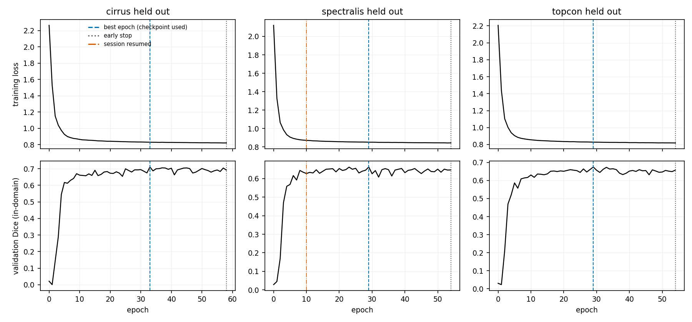
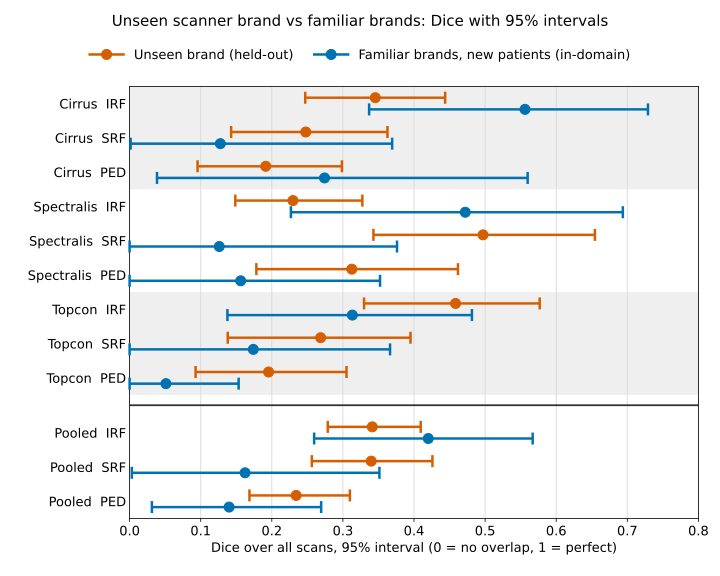
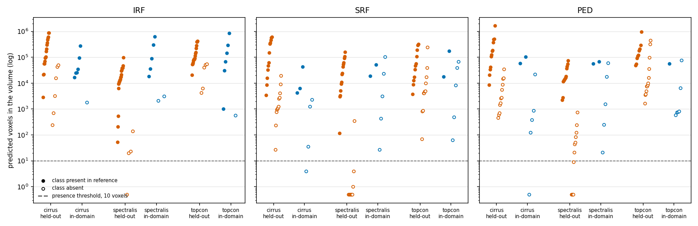
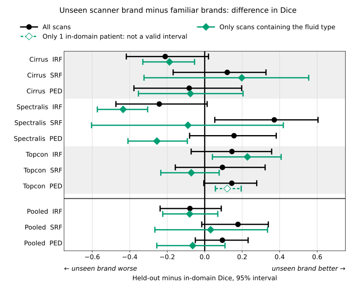
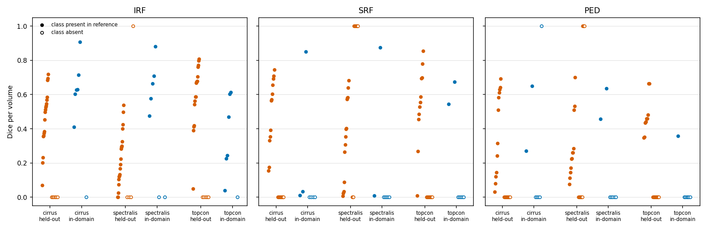

<!--
Document: Analytical Validation Report
Status: DRAFT v0.3 — results from committed records only; figures added and redrawn 2026-10-07
Owner: Anurag Yadav
Last reviewed: 2026-10-07
Change history: docs/13_change_control_log.md
-->

# Analytical Validation Report

> **Every figure in this document is copied from the committed record of the run that
> produced it**: `docs/08` §5c–§5g, built from the evaluation records under `artifacts/`. None
> is computed here for the first time. Each is labelled with its standing:
>
> - **Primary, pre-registered:** fixed in `docs/07` §17 (with §17.7 and §17.10) before the
>   data it describes was seen.
> - **Secondary, pre-registered:** `docs/07` §19, declared before spectralis or topcon was
>   evaluated.
> - **Post-hoc:** declared after the results it touches were visible.
>
> A reader can tell them apart from the label alone (`docs/07` §19.4), without reconstructing
> the chronology.
>
> **Figures 1–5 add no result.** They are drawn from the same records by
> `scripts/07_make_figures.py`, which refuses to draw if a per-fold Dice interval differs from
> its stored record, a pooled interval from the §5.2 table, or a difference interval from the
> §5.4 table (`07_make_figures.py:121-184`). Their captions are generated with them
> (`docs/figures/captions.md`) and reproduced here unchanged.

## Summary

**The pre-registered question** (`docs/07` §17; CLAUDE.md §1): when a fluid-segmentation model
is trained on two OCT vendors, how much worse does it perform on the third, unseen vendor? The
comparison is against unseen patients from the vendors it was trained on.

**Headline — primary, pre-registered.** **No cross-vendor difference in Dice is established at
95%, in either direction.** In all three folds, and for each of the three fluid classes, the
held-out and in-domain intervals overlap: 9 of 9 comparisons. The point differences point both
ways, worse on the unseen vendor in 3 of 9 and better in 6 of 9. Neither the expected
degradation nor its absence is demonstrated. **The main limitation is the in-domain arms: 7
patients per fold**, which leaves Dice intervals 0.15–0.52 wide.

**What the study could detect** (post-hoc, §5.4, derived from directly bootstrapped difference
intervals). An observed difference must exceed half the interval's width to exclude zero:

- **per fold:** 0.14–0.29 Dice;
- **pooled across folds:** 0.14–0.18 Dice.

A true difference of that size would be detected only about half the time. **Differences
smaller than about 0.14 Dice cannot be detected by this design**, and per-fold differences
below about 0.3 are detected unreliably.

**Overlap of two intervals is a conservative criterion, not a test of the difference**, so §5.4
also bootstraps the difference directly (post-hoc). **One of the nine pre-registered per-fold
comparisons then excludes zero: spectralis SRF, held-out − in-domain +0.3710 [+0.0537,
+0.6045]**. The held-out vendor scores *higher*. It is the cell most exposed to the case-mix
confound of finding 1: 7 SRF-absent spectralis volumes scored Dice 1, against an in-domain arm
that is 71% SRF-absent. Restricted to class-present volumes, the same comparison is [−0.6036,
+0.4193]. Across 24 difference intervals with no multiplicity correction, a single exclusion is
**weak evidence**, and this one is better explained by composition than by vendor. None of the
six pooled difference intervals excludes zero.

**The design removed the most obvious vendor signature on purpose.** Per-volume intensity
normalisation took out the Topcon brightness offset, a detector pedestal perfectly correlated
with vendor. So the absence of a detectable gap may partly reflect that choice, and every gap
here is a lower bound on the raw-data gap (§8.1).

**Further findings, in order of weight.**

1. **False positives in class-absent volumes dominate the all-volume Dice** (§7.1; secondary,
   pre-registered except for cirrus, where it is post-hoc). In 14 of 18 fold × arm × class
   cells, every class-absent volume scored Dice 0: the model predicted some of the class where
   there was none. This also **confounds vendor with case mix** (§5.2, post-hoc). The
   in-domain arms carry more class-absent volumes than the held-out arms, 62% against 47% for
   SRF and 77% against 53% for PED, pooled, so their all-volume Dice is pulled down harder.
2. **The metric is fragile in small arms** (§7.2). One model's in-domain SRF Dice moved by 0.1431
   between two equally valid MC-dropout draws. One class-absent volume flipping between Dice 1
   and 0 moves a 7-patient mean by 1/7 = 0.1429. The record that would confirm this mechanism
   does not exist.
3. **The pooled comparison does not change the headline** (§5.1, §5.3; post-hoc pooling rule).
   Pooled over folds with the patient as the unit (70 held-out against 13 in-domain), all three
   classes overlap. That holds on all volumes and on class-present volumes alone. The
   class-present view, the cleaner one for the vendor question, also overlaps in all three
   classes, with in-domain arms of 11, 5 and 3 patients.

**What this report does not claim.** It does not claim that the model generalises to unseen
vendors, nor that it generalises better or worse than in domain. It does not claim the absence
of a vendor effect. A difference of the size this design can detect has not been seen, and the
design cannot see a smaller one.

## 1. Objective

Quantify the cross-vendor generalisation of retinal OCT fluid segmentation (IRF, SRF, PED).
Train on two vendors, evaluate on the third, and compare against unseen patients of the
training vendors. Report every figure per class, per vendor, with a patient-level 95% interval
and its `n` (CLAUDE.md §5).

## 2. Method

| Element | As run | Defined in |
|---|---|---|
| Data | RETOUCH training partition, 70 volumes, one per patient: cirrus 24, spectralis 24, topcon 22 | `docs/06` §1, §3.1 |
| Folds | leave-one-vendor-out: held-out vendor = `test`; per fold, `val` and an in-domain reference of 7 patients each, drawn from the training vendors | `docs/06` §6, `configs/folds/` |
| Model | 2-D UNet, instance norm, dropout 0.2; checkpoint selected on in-domain `val` only: cirrus epoch 33, spectralis 29, topcon 29 | `docs/08` §5c, §5e, §5f |
| Inference | mean of 20 MC-dropout passes, **seeded per volume**, deterministic kernels; predictions inverted to native geometry before measurement | SRS-029, SRS-091, SRS-074 |
| Metrics | Dice and HD95 (max of directed, mm) per class. Detection is derived from the segmentation: present when predicted voxels > 10; AUROC from the MC mean probability | `docs/07` §17.2, §17.7a |
| Intervals | patient-level bootstrap, 2000 resamples, α = 0.05, seed 20260916. HD95 drops volumes where exactly one of prediction and reference is empty, so its `n` can be smaller | SRS-087, `docs/07` §17.3 |
| Gap | in-domain − held-out, **a point difference with no interval**: the two arms are bootstrapped separately | `docs/07` §17.2 |
| Sealed access | each `test` and `in_domain_ref` bucket evaluated once under the seeded procedure. Cirrus also has an earlier unseeded draw, kept and labelled (§3.1) | `docs/07` §17.10, `docs/08` §5g.1 |
| Reproducibility | two seeded evaluations of the open `val` bucket at the evaluation commit were IDENTICAL on every one of 466 compared values before any unlock | `docs/08` §5g.1, HAZ-016, RC-032 |

**Figure 1. Training loss and in-domain validation Dice per fold.** From each fold's `epochs.jsonl` (cirrus: 59 epochs, best 33, stopped after 58; spectralis: 55 epochs, best 29, stopped after 54; topcon: 55 epochs, best 29, stopped after 54). Every fold ended by early stopping, after 25 epochs without improvement. The checkpoint evaluated is the best epoch, chosen on in-domain validation only (§17.1). The dash-dot line marks where the spectralis run was resumed after an external interruption (`docs/08` D8). Validation Dice here is a training record, a point value with no interval, and is not a result.

## 3. Results — segmentation (primary, pre-registered)

**Gap convention:** for Dice, a positive gap means worse on the unseen vendor. For HD95, where
lower is better, a positive gap means the in-domain arm is worse. `n` is patients.

| Held-out vendor (trained on) | Class | Held-out Dice | In-domain reference Dice | Gap | Intervals overlap |
|---|---|---|---|---|---|
| cirrus (spectralis + topcon) | IRF | **0.3456** [0.2470, 0.4438] n=24 | **0.5561** [0.3369, 0.7291] n=7 | +0.2105 | yes |
| cirrus (spectralis + topcon) | SRF | **0.2478** [0.1428, 0.3627] n=24 | **0.1276** [0.0015, 0.3693] n=7 | -0.1201 | yes |
| cirrus (spectralis + topcon) | PED | **0.1915** [0.0956, 0.2987] n=24 | **0.2742** [0.0385, 0.5599] n=7 | +0.0827 | yes |
| spectralis (cirrus + topcon) | IRF | **0.2298** [0.1487, 0.3273] n=24 | **0.4721** [0.2269, 0.6937] n=7 | +0.2424 | yes |
| spectralis (cirrus + topcon) | SRF | **0.4971** [0.3429, 0.6544] n=24 | **0.1261** [0.0000, 0.3761] n=7 | -0.3710 | yes |
| spectralis (cirrus + topcon) | PED | **0.3125** [0.1783, 0.4618] n=24 | **0.1562** [0.0000, 0.3522] n=7 | -0.1563 | yes |
| topcon (cirrus + spectralis) | IRF | **0.4585** [0.3297, 0.5768] n=22 | **0.3133** [0.1376, 0.4815] n=7 | -0.1452 | yes |
| topcon (cirrus + spectralis) | SRF | **0.2687** [0.1380, 0.3951] n=22 | **0.1740** [0.0000, 0.3663] n=7 | -0.0947 | yes |
| topcon (cirrus + spectralis) | PED | **0.1955** [0.0928, 0.3051] n=22 | **0.0511** [0.0000, 0.1534] n=7 | -0.1444 | yes |

| Held-out vendor (trained on) | Class | Held-out HD95 (mm) | In-domain reference HD95 (mm) | Gap | Intervals overlap |
|---|---|---|---|---|---|
| cirrus (spectralis + topcon) | IRF | 1.4973 [0.3614, 3.0828] n=18 | 0.9594 [0.0446, 2.0126] n=6 | -0.5380 | yes |
| cirrus (spectralis + topcon) | SRF | 1.2215 [0.2693, 2.3118] n=12 | 7.6029 [0.0355, 17.1420] n=3 | +6.3813 | yes |
| cirrus (spectralis + topcon) | PED | 1.5850 [0.6284, 2.9064] n=12 | 0.0879 [0.0000, 0.2215] n=3 | -1.4971 | **no** |
| spectralis (cirrus + topcon) | IRF | 2.1144 [0.8778, 3.8042] n=21 | 1.2267 [0.0349, 3.5668] n=5 | -0.8877 | yes |
| spectralis (cirrus + topcon) | SRF | 1.6210 [0.2542, 3.8001] n=21 | 3.1980 [0.0156, 6.3804] n=2 | +1.5770 | yes |
| spectralis (cirrus + topcon) | PED | 0.7311 [0.1511, 1.5883] n=16 | 2.2425 [0.0369, 4.4482] n=2 | +1.5115 | yes |
| topcon (cirrus + spectralis) | IRF | 2.5188 [1.2436, 3.9942] n=17 | 1.6540 [0.1387, 4.6278] n=6 | -0.8647 | yes |
| topcon (cirrus + spectralis) | SRF | 3.9000 [1.6269, 6.5503] n=11 | 9.7733 [0.1212, 19.4254] n=2 | +5.8733 | yes |
| topcon (cirrus + spectralis) | PED | 1.3764 [0.6491, 2.1073] n=9 | 4.6798 (single patient, no spread) n=1 | +3.3035 | **no** |

**Dice: all nine comparisons overlap.** **HD95: two do not**, cirrus PED and topcon PED, and
their in-domain arms hold **3** and **1** patients. An interval over one patient has no spread,
so nothing is concluded from either.

**Figure 2. Held-out and in-domain Dice with 95% intervals.** In all 12 rows the held-out interval (orange) overlaps the in-domain one (blue), so no difference is established; the in-domain intervals are wide because those arms are small. Per-fold rows are the primary, pre-registered figures of §3 (held-out n = 24, 24, 22 patients; in-domain n = 7 per fold). The pooled rows (n = 70 and 13) use the patient-as-unit rule decided after the per-fold results (§5.1, `docs/07` §19.5): **post-hoc**.

### 3.1 Cirrus — the seeded record beside the earlier unseeded draw

Cirrus was first evaluated on 2026-10-01 without seeded MC-dropout. That draw cannot be
reproduced (`docs/13`, 2026-10-04). It is kept, not replaced. The seeded figures above are the
reproducible record, and the only ones carried into any cross-fold statement.

| Class | Arm | Seeded (reproducible record) | Unseeded 2026-10-01 (single draw) | Difference |
|---|---|---|---|---|
| IRF | held-out | 0.3456 [0.2470, 0.4438] n=24 | 0.3452 [0.2461, 0.4433] n=24 | +0.0004 |
| IRF | in-domain | 0.5561 [0.3369, 0.7291] n=7 | 0.5543 [0.3370, 0.7272] n=7 | +0.0018 |
| SRF | held-out | 0.2478 [0.1428, 0.3627] n=24 | 0.2481 [0.1431, 0.3632] n=24 | -0.0003 |
| SRF | in-domain | 0.1276 [0.0015, 0.3693] n=7 | 0.2707 [0.0048, 0.5727] n=7 | -0.1431 |
| PED | held-out | 0.1915 [0.0956, 0.2987] n=24 | 0.1916 [0.0956, 0.2987] n=24 | -0.0001 |
| PED | in-domain | 0.2742 [0.0385, 0.5599] n=7 | 0.2740 [0.0387, 0.5598] n=7 | +0.0001 |

## 4. Results — detection (primary, pre-registered)

Sensitivity and specificity are at the fixed threshold of 10 predicted voxels, reported as they
fell (§17.7a). **AUROC is primary, because it is threshold-free.** It carries **no interval**,
because the per-volume detection score was not persisted in any sealed record (`docs/08` D9).
That is a gap against CLAUDE.md §5, stated rather than hidden (§8.7).

| Held-out vendor | Class | Arm | AUROC (positives/negatives) | Sensitivity | Specificity |
|---|---|---|---|---|---|
| cirrus | IRF | held-out | **1.0000** (+18/−6) | 1.0000 [1.0000, 1.0000] n=18 | 0.0000 [0.0000, 0.0000] n=6 |
| cirrus | IRF | in-domain | **1.0000** (+6/−1) | 1.0000 [1.0000, 1.0000] n=6 | 0.0000 (single patient, no spread) n=1 |
| cirrus | SRF | held-out | **0.9931** (+12/−12) | 1.0000 [1.0000, 1.0000] n=12 | 0.0000 [0.0000, 0.0000] n=12 |
| cirrus | SRF | in-domain | **1.0000** (+3/−4) | 1.0000 [1.0000, 1.0000] n=3 | 0.2500 [0.0000, 0.7500] n=4 |
| cirrus | PED | held-out | **0.9514** (+12/−12) | 1.0000 [1.0000, 1.0000] n=12 | 0.0000 [0.0000, 0.0000] n=12 |
| cirrus | PED | in-domain | **1.0000** (+2/−5) | 1.0000 [1.0000, 1.0000] n=2 | 0.2000 [0.0000, 0.6000] n=5 |
| spectralis | IRF | held-out | **1.0000** (+20/−4) | 1.0000 [1.0000, 1.0000] n=20 | 0.2500 [0.0000, 0.7500] n=4 |
| spectralis | IRF | in-domain | **1.0000** (+5/−2) | 1.0000 [1.0000, 1.0000] n=5 | 0.0000 [0.0000, 0.0000] n=2 |
| spectralis | SRF | held-out | **0.9929** (+14/−10) | 1.0000 [1.0000, 1.0000] n=14 | 0.9000 [0.7000, 1.0000] n=10 |
| spectralis | SRF | in-domain | **0.7000** (+2/−5) | 1.0000 [1.0000, 1.0000] n=2 | 0.0000 [0.0000, 0.0000] n=5 |
| spectralis | PED | held-out | **0.9931** (+12/−12) | 1.0000 [1.0000, 1.0000] n=12 | 0.4167 [0.1667, 0.6667] n=12 |
| spectralis | PED | in-domain | **1.0000** (+2/−5) | 1.0000 [1.0000, 1.0000] n=2 | 0.0000 [0.0000, 0.0000] n=5 |
| topcon | IRF | held-out | **1.0000** (+17/−5) | 1.0000 [1.0000, 1.0000] n=17 | 0.0000 [0.0000, 0.0000] n=5 |
| topcon | IRF | in-domain | **1.0000** (+6/−1) | 1.0000 [1.0000, 1.0000] n=6 | 0.0000 (single patient, no spread) n=1 |
| topcon | SRF | held-out | **0.9793** (+11/−11) | 1.0000 [1.0000, 1.0000] n=11 | 0.0000 [0.0000, 0.0000] n=11 |
| topcon | SRF | in-domain | **1.0000** (+2/−5) | 1.0000 [1.0000, 1.0000] n=2 | 0.0000 [0.0000, 0.0000] n=5 |
| topcon | PED | held-out | **1.0000** (+9/−13) | 1.0000 [1.0000, 1.0000] n=9 | 0.0000 [0.0000, 0.0000] n=13 |
| topcon | PED | in-domain | **1.0000** (+1/−6) | 1.0000 (single patient, no spread) n=1 | 0.0000 [0.0000, 0.0000] n=6 |

**Sensitivity is 1.0000 in every cell, and specificity is 0.0000 in 13 of 18.** At 10 voxels
the model calls almost every class present in almost every volume, which is the detection face
of the false-positive pattern in §7.1. The ranking is informative, with AUROC 0.95–1.00 in every
held-out arm. The fixed operating point is not. In-domain AUROC rests on 1–6 positives per
cell. The §19.2 validation-selected threshold is reported in §7.3, beside these figures and
never instead of them.

**Figure 3. Predicted voxel count by reference presence, log scale.** One point per patient and class; a volume with no predicted voxels is drawn at 0.5. The dashed line is the pre-registered presence threshold of 10 voxels (§17.7a). Volumes without the class (open) mostly sit far above it, which is why specificity at that threshold is 0.0000 in 13 of 18 cells (§4). **ROC curves are not shown:** they need each volume's detection score, which the sealed records did not persist (`docs/08` D9). A curve built from voxel counts would rank a different score from the one the reported AUROC uses.

## 5. Generalisation gap

The per-fold gaps are in the tables of §3. This section reports the pooled view and what
confounds it.

### 5.1 Pooled across folds — secondary, **post-hoc pooling rule**

§19.3 pre-registered a pooled comparison. Its own assertion then failed: the three in-domain
arms hold 21 volumes from **13** patients, and 8 patients appear in two folds. The author fixed
the rule after the per-fold results were visible (`docs/07` §19.5, committed `3ed36ae` before
computing):

- **the patient is the unit**;
- an in-domain patient contributes the mean of its Dice across the folds holding it;
- a held-out patient contributes its single value.

### 5.2 All-volume Dice confounds vendor with case mix — post-hoc

**The mechanism.** Under the both-empty convention, a class-absent volume scores Dice 1.0 if
nothing is predicted and 0.0 if anything is (`metrics.py:104-117`). This model nearly always
predicts something (§7.1), so **class-absent volumes score 0**. An arm's all-volume Dice is
therefore pulled down in proportion to its share of class-absent volumes, whatever the vendor.
If two arms differ in that share, their all-volume Dice differs for a reason that has nothing
to do with vendor shift.

**The arms do differ.** Fraction of class-absent volumes, beside the pooled figures:

| Class | Pooled held-out Dice | Held-out class-absent | Pooled in-domain Dice | In-domain class-absent | Gap |
|---|---|---|---|---|---|
| IRF | **0.3414** [0.2787, 0.4094] n=70 | 15/70 (21%) | **0.4201** [0.2595, 0.5669] n=13 | 2/13 (15%) | +0.0787 |
| SRF | **0.3398** [0.2563, 0.4259] n=70 | 33/70 (47%) | **0.1624** [0.0031, 0.3514] n=13 | 8/13 (62%) | -0.1774 |
| PED | **0.2343** [0.1686, 0.3098] n=70 | 37/70 (53%) | **0.1400** [0.0314, 0.2694] n=13 | 10/13 (77%) | -0.0942 |

Per fold (volumes; the in-domain arms are 7 each):

| Class | cirrus held-out | cirrus in-domain | spectralis held-out | spectralis in-domain | topcon held-out | topcon in-domain |
|---|---|---|---|---|---|---|
| IRF | 6/24 (25%) | 1/7 (14%) | 4/24 (17%) | 2/7 (29%) | 5/22 (23%) | 1/7 (14%) |
| SRF | 12/24 (50%) | 4/7 (57%) | 10/24 (42%) | 5/7 (71%) | 11/22 (50%) | 5/7 (71%) |
| PED | 12/24 (50%) | 5/7 (71%) | 12/24 (50%) | 5/7 (71%) | 13/22 (59%) | 6/7 (86%) |

**What this means for the headline, measured.** For SRF and PED, the in-domain arms carry more
class-absent volumes than the held-out arms in every fold. Pooled, that is 62% against 47%
(SRF) and 77% against 53% (PED). So a share of the negative SRF and PED gaps, where the
in-domain arm appears worse, comes from the arms' composition, not from the vendor. That share
cannot be assigned from these figures. The exception runs the other way: spectralis held out,
where absent volumes often scored 1.0 (§7.1), lifting that arm's all-volume figure.

### 5.3 Class-present-only comparison — post-hoc, the cleaner view of the vendor question

Restricted to volumes where the class is present in the reference, the composition confound of
§5.2 is removed. What remains is segmentation agreement where there is something to agree
about. **Post-hoc; it does not replace the pre-registered figures of §3.** It comes from the
§19.1 decomposition (pre-registered as a decomposition for spectralis and topcon, post-hoc for
cirrus). The pooling follows the §19.5 rule.

| Comparison | Class | Held-out, class present | In-domain, class present | Gap | Intervals overlap |
|---|---|---|---|---|---|
| cirrus | IRF | 0.4608 [0.3801, 0.5354] n=18 | 0.6488 [0.5299, 0.7737] n=6 | +0.1880 | yes |
| cirrus | SRF | 0.4955 [0.3784, 0.6035] n=12 | 0.2978 [0.0103, 0.8509] n=3 | -0.1977 | yes |
| cirrus | PED | 0.3830 [0.2454, 0.5146] n=12 | 0.4596 [0.2696, 0.6495] n=2 | +0.0765 | yes |
| spectralis | IRF | 0.2257 [0.1599, 0.2921] n=20 | 0.6610 [0.5509, 0.7851] n=5 | +0.4352 | **no** |
| spectralis | SRF | 0.3522 [0.2338, 0.4749] n=14 | 0.4415 [0.0080, 0.8749] n=2 | +0.0893 | yes |
| spectralis | PED | 0.2917 [0.1966, 0.4029] n=12 | 0.5468 [0.4573, 0.6363] n=2 | +0.2551 | **no** |
| topcon | IRF | 0.5933 [0.5036, 0.6721] n=17 | 0.3655 [0.1981, 0.5242] n=6 | -0.2278 | yes |
| topcon | SRF | 0.5374 [0.3971, 0.6681] n=11 | 0.6090 [0.5449, 0.6731] n=2 | +0.0716 | yes |
| topcon | PED | 0.4779 [0.4148, 0.5524] n=9 | 0.3578 (single patient, no spread) n=1 | -0.1200 | **no** |
| **pooled** (patient as unit) | IRF | **0.4163** [0.3586, 0.4731] n=55 | **0.4965** [0.3542, 0.6320] n=11 | +0.0802 | yes |
| **pooled** (patient as unit) | SRF | **0.4537** [0.3753, 0.5259] n=37 | **0.4223** [0.1212, 0.7234] n=5 | -0.0315 | yes |
| **pooled** (patient as unit) | PED | **0.3757** [0.3075, 0.4461] n=33 | **0.4400** [0.2696, 0.6429] n=3 | +0.0643 | yes |

**Pooled, all three classes overlap.** The gaps are +0.0802 (IRF), −0.0315 (SRF) and +0.0643
(PED). **The in-domain class-present arms hold 11, 5 and 3 patients**, so the intervals on that
side are 0.28–0.60 wide. The class-present view is cleaner, but it is not more decisive: it
removes the confound and the sample shrinks with it.

Per fold, three comparisons do not overlap. In spectralis IRF and PED the in-domain arm is
higher, with 5 and 2 in-domain patients. In topcon PED the in-domain arm is a single patient
with no spread. No vendor-specific conclusion is drawn from in-domain strata this small.

### 5.4 The difference bootstrapped directly — post-hoc

**Why, and why post-hoc.** Two 95% intervals that overlap can still belong to a difference whose
own interval excludes zero. Overlap is a conservative criterion, not a test of the difference.
The pre-registered criterion (§17.2) is overlap, and the headline in the Summary keeps it
unchanged. This analysis was requested on 2026-10-05, after every result was visible, so it is
**post-hoc**.

**Method.** For each comparison, each replicate resamples each arm's patients independently and
with replacement, then records held-out mean − in-domain mean. The sign is **opposite to the gap
in §3**: here negative means worse on the unseen vendor. The interval is a percentile interval,
from 2000 replicates, seed 20260916. Each held-out arm's own interval was checked to reproduce
the project's estimator exactly. In the pooled rows the two arms share their 13 in-domain
patients, so independent resampling there is an approximation that ignores the shared patients.

| View | Comparison | Class | Held-out − in-domain [95% interval] | Width | n (held-out / in-domain) | Excludes 0 |
|---|---|---|---|---|---|---|
| all-volume | cirrus | IRF | -0.2105 [-0.4181, +0.0202] | 0.4384 | 24 / 7 | no |
| all-volume | cirrus | SRF | +0.1201 [-0.1684, +0.3269] | 0.4953 | 24 / 7 | no |
| all-volume | cirrus | PED | -0.0827 [-0.3774, +0.1975] | 0.5749 | 24 / 7 | no |
| all-volume | spectralis | IRF | -0.2424 [-0.4736, +0.0132] | 0.4868 | 24 / 7 | no |
| all-volume | spectralis | SRF | +0.3710 [+0.0537, +0.6045] | 0.5508 | 24 / 7 | **yes** |
| all-volume | spectralis | PED | +0.1563 [-0.0805, +0.3816] | 0.4621 | 24 / 7 | no |
| all-volume | topcon | IRF | +0.1452 [-0.0723, +0.3571] | 0.4293 | 22 / 7 | no |
| all-volume | topcon | SRF | +0.0947 [-0.1567, +0.3223] | 0.4790 | 22 / 7 | no |
| all-volume | topcon | PED | +0.1444 [-0.0048, +0.2774] | 0.2822 | 22 / 7 | no |
| all-volume | **pooled** | IRF | -0.0787 [-0.2378, +0.0884] | 0.3262 | 70 / 13 | no |
| all-volume | **pooled** | SRF | +0.1774 [-0.0157, +0.3393] | 0.3550 | 70 / 13 | no |
| all-volume | **pooled** | PED | +0.0942 [-0.0500, +0.2315] | 0.2816 | 70 / 13 | no |
| class-present | cirrus | IRF | -0.1880 [-0.3299, -0.0541] | 0.2758 | 18 / 6 | **yes** |
| class-present | cirrus | SRF | +0.1977 [-0.3236, +0.5548] | 0.8784 | 12 / 3 | no |
| class-present | cirrus | PED | -0.0765 [-0.3535, +0.2046] | 0.5580 | 12 / 2 | no |
| class-present | spectralis | IRF | -0.4352 [-0.5726, -0.3042] | 0.2684 | 20 / 5 | **yes** |
| class-present | spectralis | SRF | -0.0893 [-0.6036, +0.4193] | 1.0230 | 14 / 2 | no |
| class-present | spectralis | PED | -0.2551 [-0.4093, -0.0924] | 0.3169 | 12 / 2 | **yes** |
| class-present | topcon | IRF | +0.2278 [+0.0413, +0.4078] | 0.3664 | 17 / 6 | **yes** |
| class-present | topcon | SRF | -0.0716 [-0.2342, +0.0771] | 0.3114 | 11 / 2 | no |
| class-present | topcon | PED | +0.1200 [+0.0570, +0.1946] | 0.1376 | 9 / 1 | **yes** (in-domain n=1: interval ignores in-domain variance) |
| class-present | **pooled** | IRF | -0.0802 [-0.2238, +0.0697] | 0.2935 | 55 / 11 | no |
| class-present | **pooled** | SRF | +0.0315 [-0.2657, +0.3351] | 0.6008 | 37 / 5 | no |
| class-present | **pooled** | PED | -0.0643 [-0.2554, +0.1084] | 0.3638 | 33 / 3 | no |

**Six of 24 exclude zero, with no multiplicity correction.**

- **All-volume, per fold: one of nine.** Spectralis SRF, +0.3710: the held-out vendor scores
  *higher*. It is the cell most exposed to §5.2's composition confound. Its class-present
  counterpart does not exclude zero.
- **Class-present, per fold: five of nine, in both directions.** Held-out is lower in cirrus IRF,
  spectralis IRF and spectralis PED, and higher in topcon IRF and topcon PED. They rest on
  in-domain strata of 6, 5, 2, 6 and **1** patient. The topcon PED interval comes from a single
  in-domain patient, ignores all in-domain variance, and is not a valid interval.
- **Pooled, all-volume and class-present: none of six.**

With 24 intervals and no correction, about one exclusion is expected by chance alone if there
were no differences anywhere (derived: 24 × 0.05; the intervals are not independent, so this is
indicative only). Exclusions that point in opposite directions, on strata of 1–6 patients, do
not add up to a vendor effect. **No cross-vendor difference is concluded from them.**

**What the widths say the study can detect.** Half the interval width is the smallest observed
difference that excludes zero (derived from the table above):

| View | Half-width |
|---|---|
| all-volume, per fold | 0.14–0.29 |
| all-volume, pooled | 0.14–0.18 |
| class-present, pooled | 0.15–0.30 |

A true difference at that size is detected only about half the time. **This design cannot detect
cross-vendor Dice differences below about 0.14, and detects per-fold differences below about 0.3
unreliably.**

**Figure 4. Held-out minus in-domain Dice, bootstrapped directly.** Of the 24 intervals, 6 exclude zero, pointing both ways and resting on in-domain arms of 1 to 7 patients, and none of the 6 pooled intervals does, so no cross-vendor difference is concluded (§5.4). The whole figure is **post-hoc** (§5.4), and its pooled rows also use the post-hoc pooling rule (§5.1); the dashed interval has a single in-domain patient, ignores in-domain variance and is not a valid interval.

## 6. Calibration

**Not evaluated.** The MC-dropout uncertainty map is implemented and tested (SRS-029, SRS-030,
TC-055, TC-056), and so is the scan-level confidence score (RC-009). No calibration analysis,
such as a reliability diagram or expected calibration error against observed error, was
pre-registered or run, so no calibration claim is made.

## 7. Failure modes

### 7.1 False positives in class-absent volumes — §19.1, secondary

Pre-registered for spectralis and topcon. **Post-hoc for cirrus**, whose results were visible
when §19 was written (`cae1f36`). Dice of the class-absent volumes in each arm:

| Held-out vendor | Arm | IRF absent: Dice 0 / Dice 1 | SRF absent: Dice 0 / Dice 1 | PED absent: Dice 0 / Dice 1 |
|---|---|---|---|---|
| cirrus | held-out | 6 / 0 | 12 / 0 | 12 / 0 |
| cirrus | in-domain | 1 / 0 | 4 / 0 | 4 / 1 |
| spectralis | held-out | 3 / 1 | 3 / 7 | 8 / 4 |
| spectralis | in-domain | 2 / 0 | 5 / 0 | 5 / 0 |
| topcon | held-out | 5 / 0 | 11 / 0 | 13 / 0 |
| topcon | in-domain | 1 / 0 | 5 / 0 | 6 / 0 |

In **14 of 18** cells every class-absent volume scored 0: the model predicted some of the class
wherever it was absent. The exceptions are all from the spectralis-held-out model on spectralis
volumes, plus one cirrus in-domain PED volume. That model predicted nothing on 7 of 10
SRF-absent and 4 of 12 PED-absent spectralis volumes. This agrees with its held-out SRF
specificity of 0.9000 (§4). It is a measured difference in false-positive behaviour, for one
model on one vendor. Why it occurs has not been investigated.

**Consequence for every Dice in §3.** The all-volume Dice mixes two quantities in proportions
that differ by arm: overlap quality where the class is present, and false-positive behaviour
where it is not. Class-present Dice exceeds the all-volume figure in 15 of 18 cells
(`docs/08` §5g.6).

**Figure 5. Dice of every volume, split by whether the class is present in the reference.** One point per patient (held-out arms 22–24, in-domain arms 7). Filled: class present. Open: class absent, where Dice is 1 if nothing is predicted and 0 if anything is (`metrics.py:104-117`). In 14 of 18 arm × class cells every class-absent volume scores 0, which is the false-positive pattern of §7.1. The present/absent split is the §19.1 decomposition: pre-registered for spectralis and topcon, **post-hoc for cirrus**.

### 7.2 Metric fragility in small arms

**Measured.** Cirrus in-domain SRF Dice is 0.2707 in the unseeded draw and 0.1276 in the seeded
one: −0.1431, with the same model, threshold and metric (§3.1). **Arithmetic:** one
class-absent volume flipping between Dice 1 and 0 moves a 7-patient mean by 1/7 = 0.1429. The
arm has 4 SRF-absent volumes. **Not confirmable:** the unseeded record kept no per-volume rows
(`docs/08` D7). The HD95 `n` changing from 4 to 3 is consistent with a single flip, not proof
of it.

**Why it matters for reading §3.** A shift this large, from sampling alone, is 37% of the width
of the narrowest in-domain Dice interval of the unseeded record (`docs/08` §5g.2a). Every
small-arm Dice here carries that sensitivity. Seeding makes each figure reproducible. It does
not make it less sensitive to which voxels a single draw happens to predict.

### 7.3 The detection operating point — §19.2, secondary

Secondary; reported beside §4, never instead. **Post-hoc for cirrus**, pre-registered for spectralis and topcon. The rule is `docs/07` §19.2, applied exactly as written: a grid from 1 to 1000 voxels, Youden's J, selected on each fold's own seeded `val` split, ties to the smallest threshold, and the fixed 10 where `val` lacks a positive or a negative. The fixed-threshold rates recomputed by the same code reproduce every stored record exactly. AUROC is unaffected.

| Held-out vendor | Class | `val` +/− | Selected (J) | Held-out spec: fixed 10 → selected | In-domain spec: fixed 10 → selected |
|---|---|---|---|---|---|
| cirrus | IRF | 6/1 | **500** (1.0000; tie across 2 grid points, smallest wins) | 0.0000 [0.0000, 0.0000] n=6 → 0.1667 [0.0000, 0.5000] n=6 | 0.0000 [0.0000, 0.0000] n=1 → 0.0000 [0.0000, 0.0000] n=1 |
| cirrus | SRF | 5/2 | **500** (1.0000; tie across 2 grid points, smallest wins) | 0.0000 [0.0000, 0.0000] n=12 → 0.1667 [0.0000, 0.4167] n=12 | 0.2500 [0.0000, 0.7500] n=4 → 0.5000 [0.0000, 1.0000] n=4 |
| cirrus | PED | 4/3 | **1000** (0.6667) | 0.0000 [0.0000, 0.0000] n=12 → 0.2500 [0.0000, 0.5000] n=12 | 0.2000 [0.0000, 0.6000] n=5 → 0.8000 [0.4000, 1.0000] n=5 |
| spectralis | IRF | 7/0 | **10** (degenerate: no `val` negative; fixed threshold used) | 0.2500 [0.0000, 0.7500] n=4 → 0.2500 [0.0000, 0.7500] n=4 | 0.0000 [0.0000, 0.0000] n=2 → 0.0000 [0.0000, 0.0000] n=2 |
| spectralis | SRF | 6/1 | **1** (1.0000; tie across 10 grid points, smallest wins) | 0.9000 [0.7000, 1.0000] n=10 → 0.8000 [0.5000, 1.0000] n=10 | 0.0000 [0.0000, 0.0000] n=5 → 0.0000 [0.0000, 0.0000] n=5 |
| spectralis | PED | 3/4 | **1000** (0.2500) | 0.4167 [0.1667, 0.6667] n=12 → 1.0000 [1.0000, 1.0000] n=12 | 0.0000 [0.0000, 0.0000] n=5 → 0.4000 [0.0000, 0.8000] n=5 |
| topcon | IRF | 7/0 | **10** (degenerate: no `val` negative; fixed threshold used) | 0.0000 [0.0000, 0.0000] n=5 → 0.0000 [0.0000, 0.0000] n=5 | 0.0000 [0.0000, 0.0000] n=1 → 0.0000 [0.0000, 0.0000] n=1 |
| topcon | SRF | 7/0 | **10** (degenerate: no `val` negative; fixed threshold used) | 0.0000 [0.0000, 0.0000] n=11 → 0.0000 [0.0000, 0.0000] n=11 | 0.0000 [0.0000, 0.0000] n=5 → 0.0000 [0.0000, 0.0000] n=5 |
| topcon | PED | 4/3 | **1** (0.0000; tie across 10 grid points, smallest wins) | 0.0000 [0.0000, 0.0000] n=13 → 0.0000 [0.0000, 0.0000] n=13 | 0.0000 [0.0000, 0.0000] n=6 → 0.0000 [0.0000, 0.0000] n=6 |

- **Sensitivity stays 1.0000** at the selected threshold in every cell.
- **Three degenerate cases** (no `val` negative): spectralis IRF, topcon IRF and topcon SRF, where the fixed 10 is used.
- **Two all-tie cases** select 1. In spectralis SRF, J is 1.0 everywhere, and the choice **lowers** held-out specificity from 0.9000 to 0.8000. In topcon PED, J is 0.0 everywhere: no threshold on the grid separates that fold's `val` volumes at all.
- **The largest change** is spectralis PED: held-out specificity rises from 0.4167 to **1.0000** over 12 negatives at the selected 1000 voxels.

Every non-degenerate selection rests on a 7-patient `val` split with 1–4 negatives, so several are not stable operating points. **The fixed-threshold figures of §4 remain the primary detection result.**

## 8. Limitations

### 8.1 The measured cross-vendor gap is a LOWER BOUND on the raw-data gap

**Every reported cross-vendor figure is obtained after per-volume intensity
normalisation** (SRS-070): the 1st and 99th percentiles of each volume are mapped to 0
and 1 and values outside are clipped. This removes the part of the vendor difference
that is a difference in encoding rather than in imaging, so **the generalisation gap in
§5 is smaller than the gap raw data would produce.** It is a lower bound, and no figure
in this document should be read as the degradation a naive pipeline would suffer.

**What specifically is removed.** The clearest case is Topcon, which carries a raised
black level: measured across the training partition, its 1st percentile is **35/255**,
against 0/255 for Cirrus and 0/65535 for Spectralis. That is a detector offset, not
tissue. Under dtype-maximum scaling it survives as a constant brightness offset
**perfectly correlated with vendor** — measured median as a fraction of full scale is
0.122 for Cirrus, 0.132 for Spectralis and 0.235 for Topcon, so two vendors coincide and
the third is separated by a factor of nearly two for a reason that has nothing to do with
retinal anatomy. A network can read vendor identity straight off the brightness, and a
model that does so scores well in domain and has learned nothing that transfers.

**Why removing it is defensible rather than convenient.** Three reasons, and the first is
the one that matters:

1. **Leaving it in would not measure vendor shift, it would measure a bug.** A gap driven
   by an uncorrected detector offset is not evidence about whether segmentation
   transfers across scanners; it is evidence that the preprocessing was wrong. The
   residual gap after normalisation is attributable to speckle, axial resolution,
   sampling density and population differences — the things the question is actually
   about.
2. **Any deployable system would normalise.** Reporting the un-normalised gap would
   describe a system nobody would build.
3. **The correction uses no information the held-out vendor does not carry itself.** The
   window is computed from each volume individually, so the held-out vendor is treated
   identically to the training vendors and nothing about the training distribution
   leaks into test preprocessing.

**What is not claimed.** Normalisation does not remove vendor shift; it removes the
trivially correctable component. Speckle statistics, axial resolution (a factor of two
between Cirrus and Spectralis before resampling), B-scan density (49 against 128) and
field of view all differ and all survive. Those are the shift this project measures.

**How to quantify what was removed.** §5's gap can be compared against a fold trained
with dtype-maximum scaling instead of the percentile window, which would isolate the
pedestal's contribution. That run is **conditional on quota** and is not part of the
primary result; if it was not run, this section stands as a stated bound rather than a
measured one, and says so here rather than leaving the reader to assume either.

**Status, 2026-10-05: the dtype-scaling comparison run was not done.** This section therefore stands as a stated bound, not a measured one, as it said it would. Note also that no gap is established in §3. The bound applies to the point differences, which do not exceed their uncertainty either way.

### 8.2 Axial resampling

All frames are resampled axially to a declared 0.004 mm/pixel (SRS-072). The target is
the **coarsest** common choice, so no vendor is ever upsampled: upsampling would
fabricate detail and could substitute a smoothness signature for the brightness one
removed above. Cirrus is downsampled by a factor of about two and loses real axial
detail; that cost is accepted and is measurable by comparison against a native-resolution
run. All metrics and all volumes in mm³ are computed in native geometry (SRS-074), so no
reported number is expressed at the resampled spacing.

**Status, 2026-10-05: the native-resolution comparison run was not done.** The cost of downsampling cirrus is accepted and unmeasured.

### 8.3 The in-domain arms are too small to resolve the question — **the main limitation**

Each fold's in-domain reference holds 7 patients. Its Dice intervals are 0.15–0.52 wide; the
widest is cirrus PED, [0.0385, 0.5599]. Its class-present strata hold 1–6 patients. Pooling
raises the in-domain arm only to **13** patients, not the 21 that §19.3 anticipated, because 8
patients sit in two folds' references (§5.1). **Negative findings here are underpowered, not
reassuring.** A larger in-domain reference would need more data than the 70 public volumes
provide (§8.5).

### 8.4 The reference standard is of unquantified variability

Annotations are manual, from two centres, with no published per-case inter-rater agreement and
no double grading (`docs/06` §1.2). Reference variability is therefore an unquantified part of
every Dice and HD95 here. Small structures, PED in class-absent-heavy arms especially, are where
it would weigh most.

### 8.5 Seventy volumes, and no official test partition

Only the RETOUCH training partition carries public annotations, so every fold is built within
70 volumes (`docs/06` §1.3), with held-out arms of 22–24 patients. **The intervals in §3 are
wide because the data is small**, and narrower ones from this dataset would indicate a defect.

### 8.6 The pre-registered pooling assumption was false

§19.3 assumed each patient in at most one fold's in-domain reference "by construction". It was
not, and the pooling rule actually used was chosen after the per-fold results were visible
(§5.1). The pooled figures are post-hoc as a result. Each held-out patient is in exactly one
fold, so the held-out arms are unaffected.

### 8.7 Scope of the reproducibility claim, and the AUROC interval

- **Reproducibility is established on this machine only.** Seeded evaluation reproduced itself
  exactly on this GTX 1050 and torch build. On another card or build it is unproven until
  re-run (HAZ-016 residual).
- **Cirrus also has an unseeded figure, kept on the record.** It is a single draw that cannot
  be reproduced (§3.1).
- **The sealed AUROCs have no intervals, because the detection score was not persisted**
  (`docs/08` D9), against CLAUDE.md §5. A patient-level AUROC bootstrap needs each volume's
  MC-dropout mean probability. The per-volume rows of every sealed record carry Dice, HD95,
  voxel counts and reference presence, but not that score: the pipeline used it only inside
  the aggregate. This is the D7 defect repeated for a second field. **It is repaired for future
  evaluations** (SRS-089 amended, TC-126 extended), not retroactively.
- **No sealed bucket was re-unlocked to recover the scores.** Recovering them would cost one
  more unlock on each of the six buckets, about five hours of GPU, and would raise every
  bucket's access count for one statistic. The author declined, for a reason the records show:
  **the in-domain arms hold 1–6 negatives and 1–6 positives per class**. Three cells have at
  most 2 negatives and five have at most 2 positives. An interval over one negative or two
  positives carries almost no information. The held-out arms (4–13 negatives, 9–20 positives)
  would have given informative intervals. Their AUROCs, 0.95–1.00, stand as point values.

### 8.8 Image quality is not separated from appearance shift

Cirrus is reported in the literature as lower in image quality (`docs/06` §3.4). Held-out
cirrus Dice is the lowest of the three folds for SRF and PED, but not for IRF, where spectralis
is lowest. **These are comparisons across three different models, and were never
pre-registered.** The pre-registered comparison is within each fold, and it establishes no
difference (§3). So neither image quality nor appearance shift is credited with any
cross-vendor pattern: none is established for either to explain.

## 9. Conclusion

Under a pre-registered, seeded and reproducible protocol, all three folds were evaluated once.
**No cross-vendor difference in Dice is established at 95% in either direction**: per fold,
pooled, on all volumes or on class-present volumes alone. Bootstrapping the differences directly
(post-hoc) produces exclusions in both directions on very small strata, with no correction for
multiplicity, and none in any pooled comparison. The design cannot detect differences below
about 0.14 Dice, and detects per-fold differences below about 0.3 unreliably (§5.4). Per-volume
normalisation removed the most obvious vendor signature by design, so every measured gap is a
lower bound on the raw-data gap (§8.1). The study's main contributions are therefore
methodological and diagnostic, not a generalisation claim:

- the cross-vendor comparison measured to a stated precision;
- all-volume Dice on this data shown to be dominated by false positives in class-absent volumes,
  and confounded with case mix;
- a demonstration that a single MC-dropout draw can move a small-arm Dice by 0.14.

A study that could answer the question needs more in-domain patients than this dataset holds.
